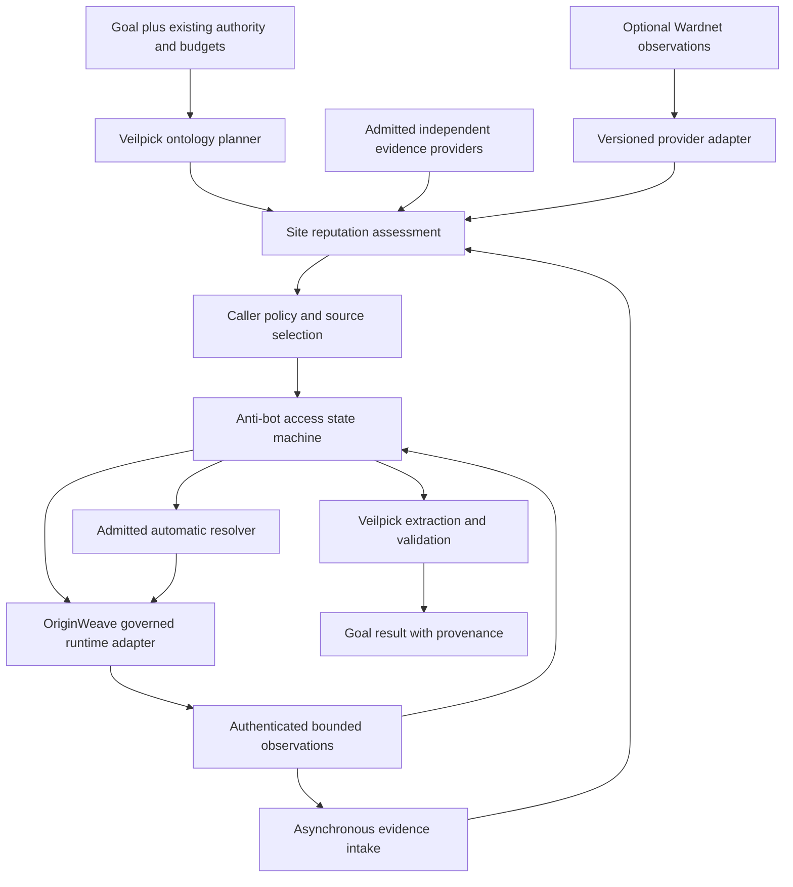

# Anti-bot and site reputation engines: product and technical design

Status: Proposed design, 2026-09-05. No runtime implementation is claimed. This specification implements the existing autonomous product contract without redefining it. Read [ADR 0004](../adr/0004-independent-anti-bot-engine.md), [ADR 0005](../adr/0005-evidence-based-site-reputation-engine.md) and the [source record](../research/access-and-reputation-evidence.md) together.

## 1. Product boundary and deployment

Veilpick composes two independently usable Rust-first engines. The anti-bot engine answers how to perform permitted acquisition despite access friction; the reputation engine answers what scoped evidence says about the target/source. The ontology planner owns the collection goal, source selection, entity mapping and extraction validation. Neither engine replaces that planner.

| Owner | Owns | Does not own |
| --- | --- | --- |
| Anti-bot engine | Access state, coherent profile selection, pacing, challenge strategy and resolution assessment | WAF/IDS, site truth, network grants, ontology goal completion |
| Reputation engine | Evidence admission, subject identity, provenance, lifecycle, coverage and multidimensional assessment | Crawling, challenge execution, gateway enforcement, fact fabrication |
| Veilpick composition | Goal/ontology planning, call ordering, policy input, extraction validation | A parallel HTTP/browser authority implementation |
| OriginWeave adapter | Binding to governed destination/TLS/HTTP/browser/presentation/policy/evidence capabilities | Claiming that HTTP success proves extracted truth |
| Optional Wardnet adapter | Sanitized, source-bound security observations | Passing a WAF block decision through as reputation or access authority |

The ecosystem composition contract in [ADR 0003](../adr/0003-stealth-and-ecosystem-composition.md) remains controlling: no duplicate provider gateway, ranking algorithm, ontology-publication lifecycle or graph truth hierarchy is introduced.

Both engines have independent libraries and standalone entry points. Initial repository co-location avoids a premature repository split while package boundaries, schemas and release versions remain separate. An extraction to separate repositories must preserve the same conformance fixtures and require no core-domain rewrite. A separately deployed service uses authenticated, tenant-scoped transport; in-process composition is the initial latency-sensitive mode.

## 2. Composition and trust boundaries



Arrows are messages/evidence, not transitive permission. Reputation queries use an existing snapshot and never synchronously crawl the queried site. New observations enter a later snapshot; the access engine cannot repeatedly call itself through reputation enrichment. The composition layer captures a snapshot generation for each planning decision and rechecks policy, revocation and runtime authority immediately before a side effect.

Untrusted page/model content cannot change a provider allowlist, origin grant, task goal, acceptance threshold or budget. A serialized origin, profile or proof reference is descriptive until its owning adapter validates it. Service requests must authenticate the submitting principal and its tenant scope; provider ingestion uses separate provider identities. Authorization cannot be inferred from caller-supplied tenant fields.

## 3. Proposed contracts

These names and signatures describe a future API; they are not compilable source or existing upstream types.

```text
AntiBotEngine.advance(event: AccessEvent, context: AccessContext)
    -> Result<AccessTransition, AccessError>
ReputationEngine.assess(query: ReputationQuery, snapshot: EvidenceSnapshot,
                        clock: TrustedClockSample)
    -> Result<SiteAssessment, AssessmentError>
```

`AccessEvent` is one of admitted task, runtime observation, resolution attempt outcome, cancellation or recovered reservation. `AccessContext` contains immutable task/tenant identifiers, runtime-owned authority handles, policy/profile/strategy versions, budget ledger reference and a trusted time sample. `AccessTransition` contains the next state, proposed bounded effects, consumed/reserved budget and reason/evidence references; it cannot dispatch I/O itself. The trusted host durably reserves effects, revalidates authority and executes them at most once per effect identifier, reconciling ambiguity rather than assuming remote exactly-once delivery.

`ReputationQuery` contains an exact typed subject, requested dimensions/provider coverage, authenticated tenant scope, consumer freshness limits and purpose. `EvidenceSnapshot` is an immutable, admitted generation, not arbitrary JSON supplied by a website. `SiteAssessment` contains schema/assessment/rule versions, subject, generation, `as_of`, `expires_at`, separate dimension states, included/excluded evidence references and coverage status. `AssessmentError` distinguishes invalid input, unauthorized scope and resource overflow from an ordinary `Unknown` assessment.

`ThreatObservationV1` is the proposed optional provider boundary, not a current Wardnet endpoint:

| Field group | Required contract |
| --- | --- |
| Identity | `schema_version`, authenticated `provider_id`, `source_record_id`, `source_version`, typed `subject`, exact `scope` |
| Time | `observed_at` when genuinely supplied, `collected_at`, `valid_from`, optional source `valid_until`, separately labeled consumer expiry |
| Meaning | Finding type, source severity, optional producer confidence, lifecycle/revocation and source completeness |
| Provenance | Original source references, parent/derived-record references, redacted content digest where permitted, adapter version |
| Isolation | Authenticated tenant/public-feed namespace and distribution/retention restrictions |

An unavailable field remains explicitly missing. A Wardnet TTL without an authoritative anchoring time is insufficient for a current positive assertion. Such a row may be retained as incomplete evidence but cannot become a fresh enforcement-grade finding. An IP finding remains IP-scoped. Generic WAF signatures such as SQL-injection patterns and gateway client-IP incidents cannot become destination-site findings. An adapter must either obtain the original complete producer record or return `InsufficientProvenance`.

Core DTOs use versioned closed discriminants and bounded fields; unknown major schemas and malformed lifecycle fields are rejected. Additive metadata remains non-authorizing. Diagnostic outputs carry counts and identifiers, not secret-bearing payloads. Adapter compatibility tests, not shared database tables, define cross-owner integration.

## 4. Resource, failure and privacy design

The following are proposed **initial test-profile limits**, not measured capacity or universal optimums. A validated deployment profile may be stricter; increasing a hard ceiling requires a reviewed profile and benchmark revision. Every task still supplies its own finite deadline and cost/byte ceilings.

| Control | Initial profile and behavior |
| --- | --- |
| Origin concurrency | One in-flight acquisition per tenant/origin quota group; an additional shared account/server quota group applies when configured. Sessions and egress changes do not create fresh groups. |
| Challenge budget | At most three dispatched resolution attempts per task, at most 90 seconds per challenge, and never beyond the remaining task deadline or cost budget. |
| Observation intake | At most 64 KiB of admitted textual detector evidence per observation; separate runtime-governed screenshot/body budgets. Truncation yields explicit incomplete evidence, not ordinary content by default. |
| Retry | Nonnegative bounded jitter and exponential local backoff from one to 60 seconds; a valid larger server cooldown is preserved, never clipped to 60 seconds. If it exceeds the task deadline, return `Deferred` non-success. |
| Assessment | At most 256 applicable evidence records per query. Overflow returns a resource error or explicitly partial non-clearance result; never silently discard a revocation or positive finding. |
| Freshness | Every provider profile declares a maximum age and coverage lease. No universal TTL is invented for all providers. Missing profile data prevents current-coverage admission. |

Parse both HTTP-date and delay-seconds `Retry-After` forms at the protocol adapter [2]. Keep source wall-clock timestamps separate from monotonic execution deadlines; clock uncertainty/regression invalidates affected freshness or scheduling claims. A 429 response body is not cached as reusable content [1]; a durable cooldown is scheduling state, not an HTTP response cache. Malformed or overflowing cooldown values produce conservative typed failure, not immediate aggressive retry.

Use per-key durable reservations and fenced leases for distributed quota/effect ownership. A restart restores cooldowns, attempt counters and unresolved effects before dispatch. Lease loss prevents new actions; ambiguous completed writes consume their reserved budget until reconciled. Cancellation stops new work but does not erase prior attempts or effects.

Persist accepted reputation observations, source versions, revocation tombstones, snapshot manifests and policy/rule revisions in a PostgreSQL adapter. Anti-bot durable budget/effect records use a separate schema and credentials. A deployment may omit persistent reputation storage only for explicitly ephemeral evaluation; production restart/replay acceptance still requires durability. Neither core contains SQL or mandates a running database for deterministic replay tests.

Store service configuration in typed registry-backed settings and credentials behind opaque handles, not runtime raw environment reads. Redact URL userinfo and query values from telemetry. Preserve URL-sensitive matching only inside an authorized protected adapter; an HMAC lookup key requires a managed tenant key and is not anonymization. Raw bodies/screenshots are opt-in evidence captures with per-class retention, access control and deletion enforcement. Cross-tenant learning or public export of private observations is disabled by default. Source distribution restrictions propagate to derivative assessments; a content digest does not create redistribution rights.

## 5. Reputation computation and performance

Compute from admitted immutable snapshots: subject/scope matching, lifecycle/version reduction, expiry filtering, lineage grouping, dimension rules, then coverage and explanation construction. `NoKnownThreat` requires complete requested provider coverage and no applicable threat; it never means unconditional safety. Positive evidence that remains valid survives a different provider's outage. Conflicts and excluded evidence remain inspectable.

Use subject/type indexes and immutable snapshot reads to avoid scanning the entire corpus per request. Bound matching records before allocation, batch provider ingestion off the query path, and atomically publish a snapshot plus its coverage manifest. Cache keys include subject, tenant/visibility, purpose, requested coverage, rule/profile version and generation; expiration and revocation invalidate results. No query-path dependency on Wardnet availability is permitted. Benchmark serialization separately from core evaluation and include worst-case lineage/conflict workloads. No latency, memory or accuracy result is asserted here.

Optional learned URL signals start in shadow mode with independently labeled, domain/time-separated data. Prevent feed-label leakage and syndicated-source duplicates across splits. Compare feed-only, rule-only and combined baselines; report precision/recall, false-positive rate, abstention/coverage, calibration and cost with denominators. Model confidence and provider confidence are separately labeled [4, 6-8]. A model rollout cannot relax evidence or authority invariants.

## 6. Required acceptance portfolio

| Case | Required observation |
| --- | --- |
| Ordinary page / 200 challenge lookalike | No extraction success until target-content validation; ambiguous/truncated detector evidence cannot silently pass |
| Applied stealth profile versus matched baseline | Runtime application and cross-surface consistency plus challenge incidence and extraction metrics; solver success is not stealth evidence |
| Supported CAPTCHA and JavaScript challenge | Actual automatic strategy, new bound browser observation, disappearance of challenge, resumed validated extraction; zero humans |
| Authentication / consent / unavailable authority | Separate non-success; no manufactured credentials, consent or implicit operator wait |
| 429 / Retry-After beyond deadline | Shared durable cooldown; no identity/egress reset; explicit `Deferred`, not success |
| Timeout after side effect / restart | Reservation restored, outcome reconciled, no blind duplicate action or refunded consumed budget |
| New site / no configured feeds / provider outage | `Unknown` or incomplete coverage, never an unconditional safe result |
| Expired / revoked / replayed finding | Tombstone/version ordering wins; no stale cache revival |
| CDN/shared IP / changed origin or redirect | No inherited publisher reputation or authority; re-evaluate exact new subject and runtime destination |
| Ten syndicated reports / contradictory evidence | Same-lineage reports do not multiply support; contradiction remains visible |
| Valid TLS with phishing evidence / reputable challenging site | Security is not canceled by TLS; access friction does not lower source reliability |
| Forged provider / hostile model / cross-tenant request | Admission rejection before effects or visibility change; no secret in diagnostics |
| Wardnet unavailable / standalone execution | Both engines remain usable with explicit coverage status and independently configured adapters |

Lock manifests before execution: source/browser/model/provider/rule/profile versions, support matrix, reference labels, trial counts and budgets. Report all trials, including unsupported, failed, cancelled and infrastructure-error outcomes; publish success among supported tasks and overall completion separately. A successful module/unit test is not end-to-end autonomous collection. Design checks, runtime tests, hosted checks and release acceptance remain separate evidence classes.

## 7. Delivery and current gaps

The two [implementation](../superpowers/plans/2026-09-05-anti-bot-engine.md) [plans](../superpowers/plans/2026-09-05-site-reputation-engine.md) define independent slices and their tests. Current delivered scope is this specification and the ADRs only. There are no Cargo manifests, live service endpoints, functioning resolvers, feed integrations, persisted ledgers or benchmark results in this PR. Those remain open implementation requirements, not optional omissions from v1.

OriginWeave candidate HTTP/presentation capabilities are observed open work, not shipped dependencies. Integration must use a verified integrated generation and retain exact compatibility evidence. The parent Veilpick product ADR PR must integrate through normal review before this stacked design is treated as default-branch policy. Wardnet's existing gap-baseline writer and runtime/security PRs are not modified.
