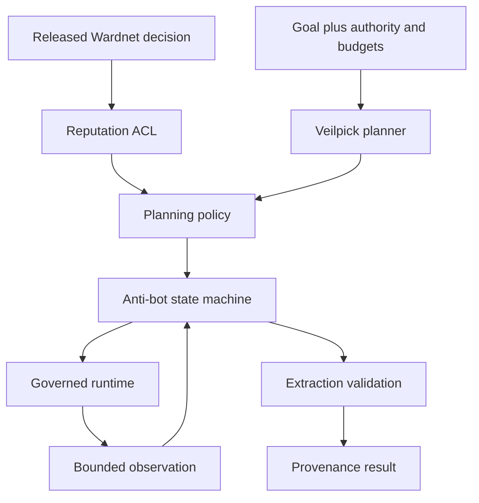

# Anti-bot engine and Wardnet reputation ACL: product and technical design

Status: Proposed design, 2026-09-05. No runtime implementation is claimed. This specification implements the existing autonomous product contract without redefining it. Read [ADR 0004](../adr/0004-independent-anti-bot-engine.md), [ADR 0005](../adr/0005-evidence-based-site-reputation-engine.md) and the [source record](../research/access-and-reputation-evidence.md) together.

## 1. Product boundary and deployment

Veilpick incubates one independently usable Rust-first anti-bot access/challenge engine and consumes destination-security reputation from Wardnet through a released contract. The ontology planner owns collection goals, source selection, entity mapping, and extraction validation. It does not become a second security-policy writer.

| Owner | Owns | Does not own |
| --- | --- | --- |
| Anti-bot engine | Access state, coherent profile selection, pacing, challenge strategy and resolution assessment | WAF/IDS, destination reputation, network grants, ontology goal completion |
| Wardnet | Destination maliciousness/reputation policy, evidence lifecycle, organizational admission policy, SOC accountability | Browser challenge execution, Veilpick extraction truth, transport authorization |
| Veilpick reputation ACL | Released-envelope validation and translation into bounded planning outcomes | Reputation reduction, feed ingestion, evidence storage, model training, Wardnet policy |
| Veilpick composition | Goal/ontology planning, call ordering, source-content validation, extraction acceptance | A parallel HTTP/browser or reputation authority implementation |
| OriginWeave/EgressWeave adapters | Their released runtime and egress authorization responsibilities | Treating Wardnet allow or HTTP success as goal completion |

Merged Wardnet PR #171 is the protected ownership correction. Wardnet PR #173 is Proposed owner work only; Veilpick cannot consume it until a compatible immutable release exists. Until then, the reputation port remains feature-disabled or uses a deterministic test double. No source import, shared database, cross-service SQL, or temporary-branch dependency is allowed.

## 2. Composition and trust boundaries


```mermaid
flowchart TD
  Goal[Goal plus authority and budgets] --> Planner[Veilpick planner]
  Wardnet[Released Wardnet decision] --> ACL[Reputation ACL]
  ACL --> Policy[Planning policy]
  Planner --> Policy
  Policy --> Access[Anti-bot state machine]
  Access --> Runtime[Governed runtime]
  Runtime --> Observation[Bounded observation]
  Observation --> Access
  Access --> Extract[Extraction validation]
  Extract --> Result[Provenance result]
```

Arrows are messages/evidence, not transitive permission. The ACL authenticates tenant/workload/purpose and exact typed subject, validates schema/action/reason/evidence-health/generation/expiry, and returns a bounded planning input. Wardnet allow is not network authority; OriginWeave/EgressWeave checks still apply before each side effect. A redirect, authority change, DNS re-resolution, or actual-peer change invalidates the prior destination decision.

Untrusted page/model content cannot change a provider allowlist, owner decision, origin grant, task goal, acceptance threshold, or budget. Veilpick never enriches a reputation decision by synchronously crawling the queried site or reading Wardnet storage.

## 3. Proposed contracts

These signatures describe future consumer ports, not existing released upstream types.

```text
AntiBotEngine.advance(event: AccessEvent, context: AccessContext)
    -> Result<AccessTransition, AccessError>
ReputationPort.assess(query: ReputationQuery)
    -> Result<ReputationDecisionEnvelope, ReputationPortError>
```

`AccessEvent`, `AccessContext`, and `AccessTransition` retain the bounded state/effect contract from ADR 0004. The trusted host reserves effects, revalidates authority, and reconciles ambiguity rather than assuming remote exactly-once delivery.

`ReputationQuery` binds authenticated tenant, workload, purpose, and exact typed destination subject. The returned owner envelope must bind schema/decision/rule versions, action and reason, evidence-health/coverage state, snapshot generation, `as_of`, `expires_at`, revocation identity, evidence references, and immutable owner release identity. Unknown major schemas, malformed lifecycle, forged scope, expired/revoked generations, and inconsistent action/reason pairs fail closed.

No `ReputationEngine`, `EvidenceSnapshot`, `ThreatObservationV1` provider intake, or reputation database is defined in Veilpick. Those are canonical-owner concerns. Consumer conformance fixtures, not shared tables or copied owner source, define compatibility.

## 4. Resource, failure and privacy design

The following are proposed **initial test-profile limits**, not measured capacity or universal optimums. A validated deployment profile may be stricter; increasing a hard ceiling requires a reviewed profile and benchmark revision. Every task still supplies its own finite deadline and cost/byte ceilings.

| Control | Initial profile and behavior |
| --- | --- |
| Origin concurrency | One in-flight acquisition per tenant/origin quota group; an additional shared account/server quota group applies when configured. Sessions and egress changes do not create fresh groups. |
| Challenge budget | At most three dispatched resolution attempts per task, at most 90 seconds per challenge, and never beyond the remaining task deadline or cost budget. |
| Observation intake | At most 64 KiB of admitted textual detector evidence per observation; separate runtime-governed screenshot/body budgets. Truncation yields explicit incomplete evidence, not ordinary content by default. |
| Retry | Nonnegative bounded jitter and exponential local backoff from one to 60 seconds; a valid larger server cooldown is preserved, never clipped to 60 seconds. If it exceeds the task deadline, return `Deferred` non-success. |
| Assessment | At most 256 applicable evidence records per query. Overflow returns a resource error or explicitly partial non-clearance result; never silently discard a revocation or positive finding. |
| Freshness | Every provider profile declares a maximum age and coverage lease. No universal TTL is invented for all providers. Missing profile data prevents current-coverage admission. |

Parse both HTTP-date and delay-seconds `Retry-After` forms at the protocol adapter [2]. Keep source wall-clock timestamps separate from monotonic execution deadlines; clock uncertainty/regression invalidates affected freshness or scheduling claims. A 429 response body is not cached as reusable content [1]; a durable cooldown is scheduling state, not an HTTP response cache. Malformed or overflowing cooldown values produce conservative typed failure, not immediate aggressive retry.

Use per-key durable reservations and fenced leases for distributed quota/effect ownership. A restart restores cooldowns, attempt counters and unresolved effects before dispatch. Lease loss prevents new actions; ambiguous completed writes consume their reserved budget until reconciled. Cancellation stops new work but does not erase prior attempts or effects.

Wardnet owns reputation evidence persistence, source versions, revocation tombstones, snapshot manifests, and policy/rule revisions. Veilpick stores no owner evidence through direct database access. A bounded consumer cache may retain admitted envelopes only under complete tenant/workload/purpose/subject/release/rule/generation keys and never past owner expiry; revocation invalidates affected entries. Anti-bot durable budget/effect records remain a separate Veilpick schema and credential boundary.

Store service configuration in typed registry-backed settings and credentials behind opaque handles, not runtime raw environment reads. Redact URL userinfo and query values from telemetry. Preserve URL-sensitive matching only inside an authorized protected adapter; an HMAC lookup key requires a managed tenant key and is not anonymization. Raw bodies/screenshots are opt-in evidence captures with per-class retention, access control and deletion enforcement. Cross-tenant learning or public export of private observations is disabled by default. Source distribution restrictions propagate to derivative assessments; a content digest does not create redistribution rights.

## 5. Reputation consumption and performance

Veilpick validates the released Wardnet envelope; it does not recompute destination reputation. `Unknown`, `NoKnownThreat`, adverse, conflicting, degraded, expired, and unavailable states retain the owner's semantics and reason codes. A favorable accessibility or source-content record cannot erase an adverse destination-security decision.

Cache keys include tenant, workload, purpose, typed subject, owner release, rule version, snapshot generation, and expiry. Bound allocations before decoding; benchmark authentication, validation, cache lookup, serialization, owner latency, and fail-closed outage paths with all failures included. No latency, memory, or accuracy result is asserted here.

Wardnet owns learned malicious-URL signals, feed/rule evaluation, calibration, false-positive analysis, and evidence-lineage reduction. Veilpick may report its own extraction provenance and claim-validation outcomes through a released producer contract, but it cannot turn them into owner decisions or a universal site score.

## 6. Required acceptance portfolio

| Case | Required observation |
| --- | --- |
| Ordinary page / 200 challenge lookalike | No extraction success until target-content validation; ambiguous/truncated detector evidence cannot silently pass |
| Applied stealth profile versus matched baseline | Runtime application and cross-surface consistency plus challenge incidence and extraction metrics; solver success is not stealth evidence |
| Supported CAPTCHA and JavaScript challenge | Actual automatic strategy, new bound browser observation, disappearance of challenge, resumed validated extraction; zero humans |
| Authentication / consent / unavailable authority | Separate non-success; no manufactured credentials, consent or implicit operator wait |
| 429 / Retry-After beyond deadline | Shared durable cooldown; no identity/egress reset; explicit `Deferred`, not success |
| Timeout after side effect / restart | Reservation restored, outcome reconciled, no blind duplicate action or refunded consumed budget |
| New site / no configured feeds / provider outage | `Unknown` or incomplete coverage, never an unconditional safe result |
| Expired / revoked / replayed finding | Tombstone/version ordering wins; no stale cache revival |
| CDN/shared IP / changed origin or redirect | No inherited publisher reputation or authority; re-evaluate exact new subject and runtime destination |
| Ten syndicated reports / contradictory evidence | Same-lineage reports do not multiply support; contradiction remains visible |
| Valid TLS with phishing evidence / reputable challenging site | Security is not canceled by TLS; access friction does not lower source reliability |
| Forged provider / hostile model / cross-tenant request | Admission rejection before effects or visibility change; no secret in diagnostics |
| Wardnet unavailable / standalone execution | Anti-bot remains independently testable, but any protected path requiring destination reputation fails closed; no local reputation fallback or copied owner logic |

Lock manifests before execution: source/browser/model/provider/rule/profile versions, support matrix, reference labels, trial counts and budgets. Report all trials, including unsupported, failed, cancelled and infrastructure-error outcomes; publish success among supported tasks and overall completion separately. A successful module/unit test is not end-to-end autonomous collection. Design checks, runtime tests, hosted checks and release acceptance remain separate evidence classes.

## 7. Delivery and current gaps

The [anti-bot implementation plan](../superpowers/plans/2026-09-05-anti-bot-engine.md) owns Veilpick runtime slices. The [reputation consumer plan](../superpowers/plans/2026-09-05-site-reputation-engine.md) begins only after Wardnet publishes an immutable compatible contract/release. Current scope is documentation only: no local reputation core, standalone reputation app, provider ingestion, database, model, or runtime integration is claimed.

OriginWeave candidate capabilities and Wardnet PR #173 are open work, not shipped dependencies. Integration must use protected, immutable releases and retain exact compatibility evidence. The Veilpick product baseline is integrated on protected `develop@cdaae4519db95141b88080d23d3cbeab6cfca31b`; this Draft remains Proposed until normal review and integration.
